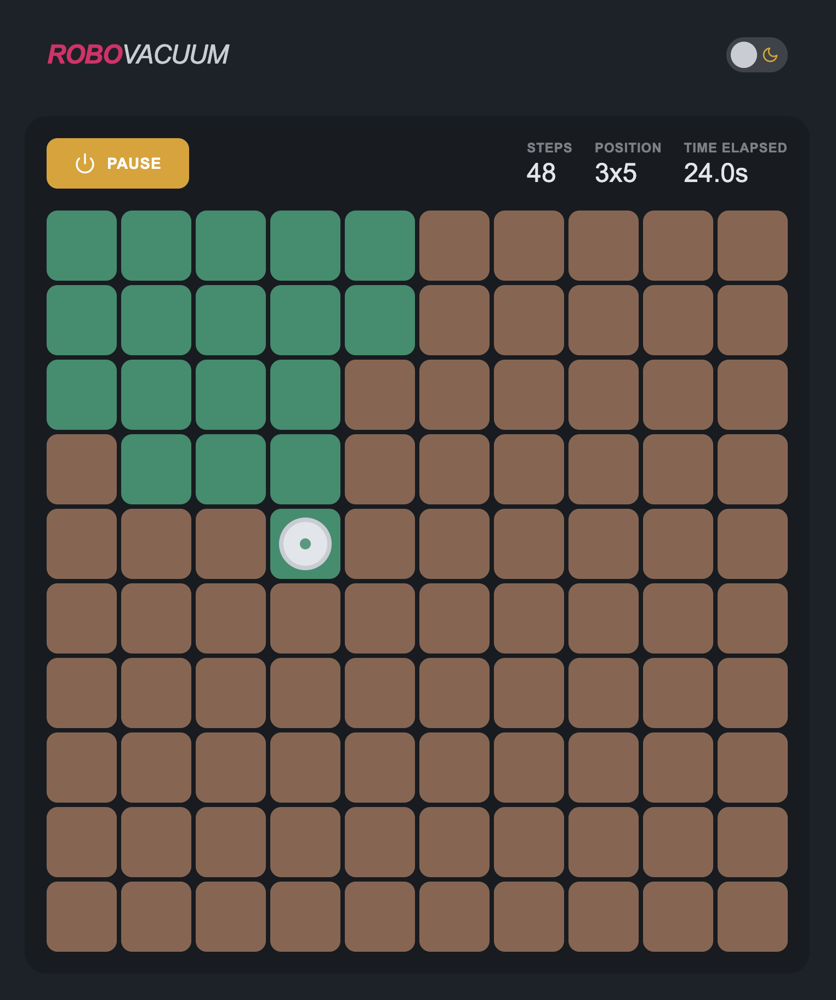

# RoboVacuum

This project is built with React and simulates a robot vacuum that randomly moves across the room and cleans the dirty floor.



## Features

- Button to start the cleaning process
- Button to pause the vacuuming
- Reset button (visible when paused or cleaning is finished)
- Display total steps
- Display current position
- Display time elapsed
- Dark/light mode

## Usage

First, install the project dependencies: `$ yarn`

Then run the app:

```bash
$ yarn start
```

## Tests

### Unit Tests

Unit and component tests are done with Jest and Testing Library ([@testing-library/react](https://github.com/testing-library/react-testing-library))

To run the tests:

```bash
$ yarn test
```

### Integration Tests

The integration tests are done with Cypress. Since the robot vacuum randomly moves in either direction (including floor tiles it's already been at), we can't know when it finishes cleaning the whole floor. Because of that, we will test that the vacuuming process can start, pause and reset. Also we check for visibility of certain elements as well as testing the dark/light-mode switch.

To run the integration tests:

```bash
$ yarn cypress-ct
```
